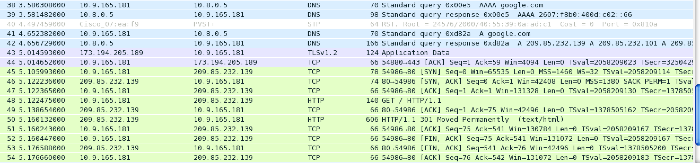

# Assignment 1

In this assignment, you will use iperf3 and wireshark to explore TCP.

## Outline

### Three parts

- [Parallel Connections](#parallel): TCP throughput vs. Number of Parallel Connections. Using iperf3.
- [RTT](#RTT): TCP throughput vs. Round Trip Time from client to server. Using iperf3.
- [Wireshark](#wireshark): Look at TCP packets when opening/grabbing a web page using wireshark.

### Deliverables

- Parallel Connections:
  - Script/code for running the parallel connections using iperf3.
  - One plot and answers to the three questions. Put into a single pdf
- RTT:
  - Script/code for running the connections to the different servers.
  - One plot and answers to the three questions. Put into the same pdf as above.
- Wireshark:
  - Two screenshots and answers to the five questions (three and two). Put into the same pdf as above.

**Summarize:**
You should have two script files, and a single pdf file (containing two plots, two screenshots, and answers to 11 questions in total).


## <a name="parallel"></a>TCP Throughput v.s. Parallel Connections

We will study how the number of parallel TCP connections affect overall TCP throughput.

### Installation

We will use [iperf3](https://iperf.fr/) for this assignment.

Installing iperf3 should be straight forward. Download iperf3 for the correct platform [https://iperf.fr/iperf-download.php](https://iperf.fr/iperf-download.php), and then unzip it to get the iperf3 executable.

### Get familiar with iperf3

Run

```
./iperf3 -h
```

to see the complete list of options for iperf3. Here, we will just demonstrate a few simple uses.

### List of public iperf servers

You can get the list of public iperf3 servers here: [https://iperf.fr/iperf-servers.php](https://iperf.fr/iperf-servers.php)

> Note, if you get an error saying “iperf3: error - the server is busy running a test. try again later”, then try connecting to the server with a different port (-p [port num]), or try another server. Or, you can also try running your own iperf3 server. Refer to Run iperf server for details.

### Connect and transmit to a server

```
./iperf3 -c bouygues.testdebit.info -p 5204
```

The above command connects to the server on port 5204 (-p option) with a single TCP connection, and tests for 10 second transmit from client (your machine) to server. Default connection port is 5201, however, servers may run iperf on different ports. Try another port if you fail to connect.

### Specify length of time to transmit

```
./iperf3 -c bouygues.testdebit.info -p 5204 -t 5
```

The above command transmits packets from client to server for 5 seconds (default is 10 seconds).

### Run parallel connections to a server

```
./iperf3 -c bouygues.testdebit.info -p 5204 -P 5
```

The above command opens up and transmits with 5 parallel TCP connections to the server (notice the capital -P here).

### What to turn in

We want to study how the number of parallel connections affects overall TCP performance. We will plot the total aggregate bandwidth vs. the number of parallel TCP connections. (You can write a shell script to automate the process of trying different number of parallel connections.)

**Script**

Bash/shell script you use to run the parallel connections. It should at least contain the specific iperf commands you run.

**Questions**

1. Describe the parameters you use, e.g., length of time to transmit (with -t), number of parallel connections (with -P), and other parameters if you specify any. Note, only the number of parallel connections should vary, and all other parameters should be fixed.
2. What's the number of parallel connections that give the highest aggregate bandwidth? What's the trend of aggregate bandwidth as the number of parallel connections increases?
3. Briefly explain the possible reasons behind what you observe. For instance, if aggregate bandwidth increases with more parallel connections at the beginning, then what's the mathematical formula that may explain this? And if aggregate bandwidth stops increasing or even decreases a bit later on, what might be the possible causes?

## <a name="RTT"></a>TCP Throughput v.s. Round Trip Time (RTT) to Server

We will study how TCP throughput varies with RTT. We will still use iperf3 for this part.

### List of public iperf servers

Again, you can get the list of public iperf3 servers here: [https://iperf.fr/iperf-servers.php](https://iperf.fr/iperf-servers.php)

### What to turn in

You will pick several iperf3 servers (at least 3, ideally located in separate geolocations), and plot bandwidth vs. the RTT to the servers. You can use ping to get the RTT.

**Script**

Bash/shell script you use to connect and ping the servers. It should at least contain the specific iperf and ping commands you run.

**Questions**

1. Describe the parameters you use, e.g., length of time to transmit (with -t), which servers you use (and where they are located), and other parameters if you specify any. Note, only the server names should vary, and all other parameters should be fixed.
2. What mathematical relationship should you expect to see between throughput and RTT? Why?
3. If what you observe from your plot is not strictly the same as what's shown in the math equation (which is usually the case), then briefly explain what are other possible factors which may affect throughput.

## <a name="wireshark"></a>Peek into a web download using Wireshark

We will use Wireshark, a network packet capture tool, to look at TCP packets when grabbing a webpage.

### Installation

You can find installation instructions here: [https://www.wireshark.org/#download](https://www.wireshark.org/#download)

On Mac and Linux, you can also install from command line (homebrew/macports, yum install, apt-get install).

If you run into any problems, you can refer to [https://www.wireshark.org/docs/wsug_html_chunked/ChapterBuildInstall.html](https://www.wireshark.org/docs/wsug_html_chunked/ChapterBuildInstall.html) for more detailed help.

### Start a live capture in Wireshark

Open wireshark interface. On the left side, select one (or more) interfaces that you want to capture from, then click “Start”. Then you should be able to see packets flowing! Click the red square button on top to stop the capture.

> Warning: keep your other network activities to the minimum for a better experience, e.g., avoid streaming Netflix when capturing in Wireshark.

### What to turn in

#### 1. Curl/wget to grab a webpage

Start a live capture in Wireshark. Then, run a curl/wget to grab a webpage. After the curl/wget is done, stop the capture in Wireshark.

Look at the packets you've captured. Example screenshot below.



**Questions**

1. What's the command that you run?
2. Any DNS packets?
3. Describe the TCP packets that you see, i.e., how each packet corresponds to TCP handshake, data transfer and closing connection steps.

#### 2. Open a webpage in a browser

Now, we will open a webpage with embeded objects (e.g., cnn.com which has a lot of images/videos embeded) in a **browser**. Again, use Wireshark to capture the traffic while you open up the page.

Example screenshot below. **You should use your own screenshot.**


**Questions**

1. Which website did you go to?
2. Do you see any parallel connections your browser makes? If so, how many can you see in your screenshot?

> Tip: you can always use filter in Wireshark to just display the packets you want to see.

